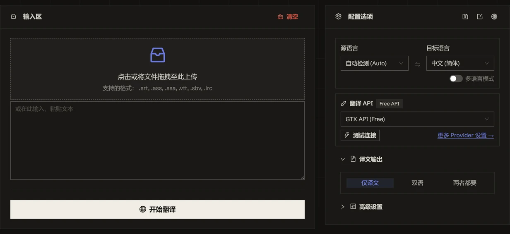

<h1 align="center">
⚡️ Subtitle Translator
</h1>
<p align="center">
    <em>AI-powered batch subtitle translation supporting 120+ languages, completed in seconds.</em>
</p>

<p align="center">
    <a href="./README.md">English</a> · <b>English</b>
</p>

<p align="center">
  <a href="LICENSE"></a>
  <a href="https://tools.newzone.top/zh/subtitle-translator"></a>
</p>

If you drop subtitle files into a general-purpose translator, you run into two problems: the model may accidentally change your timecodes, and you can only process one file at a time. Subtitle Translator separates the timeline locally and **sends only the dialogue to the engine**—the timeline is physically out of reach—then lets you drag in an entire season at once.

**Subtitle Translator** is a free, browser-only batch subtitle translation tool，支持 `.srt`、`.ass`、`.vtt`、`.lrc` 等Format。With chunk compression + parallel processing, it can translate approximately one TV episode per second.You can batch-upload subtitles for an entire season at once，integrates 8 traditional translation APIs（DeepL、Google、Azure、DeepLX、Qwen-MT、TranslateGemma、GTX、Edge）and 27 LLMs and gateways，covering 120+ languages——and can translate into multiple target languages at once, exporting each language as a separate file.Everything runs locally in the browser; subtitle content and API keys never pass through a server.For scripted batch processing, there is also a[CLI工具](#CLI)。

👉 **Try Online**：<https://tools.newzone.top/zh/subtitle-translator>



## Core Features

- **Second-level translation**：Chunk compression + parallel processing, reaching about 1 second per TV episode (the GTX interface is slightly slower).
- **Batch processing**：Drag in hundreds of subtitle files at once (an entire season in one go). Each file is translated independently and automatically downloaded with its original filename. A success/failure summary is shown at the end (e.g. "Exported (3/5)").
- **Multilingual output**：Translate into multiple target languages at once—each language is exported as a separate file, with a language code automatically appended (e.g. `movie.zh.srt`, `movie.fr.srt`).
- **Format compatibility**：Auto-detect `.srt`、`.ass`、`.vtt`、`.lrc`。WebVTT 的 NOTE / STYLE / REGION 非 cue 块会被正确跳过（不当作对白translation）。translation过程中支持一键Format互转（SRT ↔ VTT、SRT/VTT → ASS）。
- **Bilingual subtitles**：The translation can be inserted above or below the original subtitles while preserving alignment.SRT / VTT 源还可导出 **ASS**，the original and translation use Default / Secondary styles respectively（default 70pt 白色 + 55pt 青色），in the subtitle editoradjust independently。
- **Context-aware translation**（LLM only）：Each batch includes surrounding context for more coherent dialogue and more consistent character tone.
- **Structured separation**：Timelines, sequence numbers, ASS headers, and VTT cue IDs are stripped locally; only dialogue text is sent to the engine, so the model cannot disrupt the timeline.
- **Subtitle extraction**：Strip cues/timecodes and export plain text (automatically copied to the clipboard) for AI summaries, script restoration, or further creative work.
- **Unlimited caching**（IndexedDB）：All translation results are cached locally with no browser storage capacity limit; translated files are not lost when the page is refreshed.
- **120+ languages**：支持 120+ languages互译，源语言default Auto 自动检测。
- **Multilingual interface**：Based on next-intl, supporting 18 interface languages.
- **CLI**：`yarn cli` run the same engine, parser, and cache in the terminal，详见[CLI](#CLI)。
- **Privacy first**：Fully frontend-based processing—subtitle content and API keys are stored only in the browser; LLM requests go directly from the browser to your configured API endpoint.

## Translation APIs

Supports **8 traditional translation APIs** and **27 LLMs and gateways**:

### Traditional Translation APIs

| API Type             | Translation Quality | Stability | Free Quota                        |
| -------------------- | -------- | ------ | ------------------------------- |
| **DeepL**            | ★★★★★    | ★★★★☆  | 500,000 characters/month                  |
| **Google Translate** | ★★★★☆    | ★★★★★  | 500,000 characters/month                  |
| **Azure Translate**  | ★★★★☆    | ★★★★★  | **2 million characters/month for the first 12 months**  |
| **DeepLX（免费）**   | ★★★★☆    | ★★★☆☆  | Self-hosted or public free nodes            |
| **Qwen-MT**          | ★★★★☆    | ★★★★☆  | Alibaba Cloud Bailian (DashScope) quota     |
| **TranslateGemma**   | ★★★★☆    | ★★★★☆  | Self-hosted (LM Studio / Ollama, etc.) |
| **GTX API（免费）**  | ★★★☆☆    | ★★★☆☆  | Free (rate limited)              |
| **Edge API（免费）** | ★★★★☆    | ★★★☆☆  | Free (rate limited)              |

GTX and Edge require no configuration, work out of the box as the defaults, and serve as fallbacks for each other.

### AI Large Language Models

**DeepSeek**、**OpenAI**、**Claude**、**Gemini**、**Qwen**、**Moonshot (Kimi)**、**Doubao 豆包**、**Xiaomi MiMo**、**Zhipu GLM**、**MiniMax**、**Baidu ERNIE 文心**、**Tencent Hunyuan 混元**、**Mistral**、**xAI (Grok)**、**Perplexity**、**Cohere**、**YandexGPT**。

### Aggregator Gateways

**OpenRouter**、**OpenCode Zen**、**Groq**、**SiliconFlow**、**Atlas Cloud**、**GitHub Models**、**Nvidia NIM**、**Azure OpenAI**、**LiteLLM**，以及任意 **Custom (OpenAI-compatible)** 端点（Ollama / LM Studio / vLLM / Together AI / Fireworks AI 等）。

Services blocked by CORS for direct browser access can use an API relay.The built-in relay works out of the box；**API Settings → Relay URL** to point all relay-enabled services to your own relay Worker at once.

LLM mode provides:

- **Use cases**：Literary works, technical talks, multilingual dialogue
- **Customizable**：Supports system/user prompts to customize translation style
- **Temperature control**：Adjust AI creativity (0–1)
- **Thinking mode**：For reasoning models, can be enabled or disabled separately by provider

## Context-aware translation（LLM only）

LLM mode can include surrounding context with each batch request to improve dialogue coherence and consistency of character tone.

- **Concurrent lines**：Maximum number of lines translated simultaneously (default 20). Higher values may trigger rate limits.
- **Context lines**：每批携带的Context lines（default 50）。值越大连贯性越好，但 token 消耗也越多。

⚠️ **Note**：Models below 70B or small local models can easily produce misaligned text. For context mode, mainstream online LLMs (Claude, GPT, DeepSeek, Gemini, etc.) are recommended.

## Subtitle Format Support

| Format     | Auto-detect | Bilingual | Notes                                                                |
| -------- | -------- | ---- | ------------------------------------------------------------------- |
| **.srt** | ✅       | ✅   | 1–3 digit milliseconds, 100+ hour timestamps                                         |
| **.ass** | ✅       | ✅   | Leading position tags（如 `\an8`）automatically restored after translation; complex inline effect tags may be simplified       |
| **.vtt** | ✅       | ✅   | NOTE / STYLE / REGION blocks are correctly skipped；VTT→SRT automatically handles `<c.classname>` 与karaoke timestamps |
| **.lrc** | ✅       | ✅   | Correctly handles karaoke lines with multiple time tags                                      |

- **Automatic encoding detection**：jschardet Auto-detect UTF-8 / UTF-16 / GBK / Shift-JIS，避免乱码（识别失败回退 UTF-8）。
- **Filename preservation**：导出文件继承原文件名，Multilingual output额外追加语言代码后缀。
- **Format转换**：During translation, SRT ↔ VTT and SRT/VTT → ASS conversion can be performed without a separate converter (conversion requires an actual translation because the same source and target language is not allowed).

## Translation Modes

- **Batch mode**（default）：Drag in hundreds of files at once (an entire season); each file is translated independently and automatically downloaded, with a success/failure summary at the end.
- **Single-file mode**：Quick preview; a newly uploaded file replaces the current file.

## FAQ

**支持哪些Format？** SRT、ASS、VTT、LRC。SRT/VTT works with YouTube, Bilibili, and HTML5 players；ASS works with Aegisub and anime subtitle groups（Leading position tags如 `\an8` 自动还原）；LRC works with music lyrics。

**用机器translation还是 AI Large Language Models？** Machine translation (Google, DeepL, Azure, Qwen-MT) is cheap or free but dialogue can sound mediocre; large models charge by token but produce noticeably more natural translations—DeepSeek is the best value for large season-wide batches, Claude Sonnet/GPT are preferred for conversational quality, and Gemini's large context is suitable for very long subtitles.

**How do I keep names and proper nouns consistent?** 在任意大模型引擎的「系统Note词」里写一份术语保留表（如「保持原文：iPhone、OpenAI、John Smith」），entire season共享同一上下文，entire season译名一致。

**要加「保留时间轴 / 序号」之类的Note词吗？** 不Requires。时间轴、序号、头信息都在本地剥离、译完回填，模型从头到尾看不到，Note词只写translation风格、terminology与语气即可。

**Is it private?** Yes. Everything runs on the frontend: subtitle parsing, translation requests, and caching are completed in the browser; API keys are stored only in the local browser, and LLM requests go directly from the browser to your configured endpoint.

For more information, see [the complete FAQ in the official documentation](https://docs.newzone.top/guide/translation/subtitle-translator/)。

## CLI

`yarn cli` runs the **same** engine in the terminal——with the same parser, retry and rate-limit handling, and cache keys.After configuring the services in the browser, click "Export Settings" and give that JSON file to the CLI; no configuration needs to be entered again.

```bash
yarn install   # 只需一次

# Translate an entire season into Chinese using the free GTX service, with no key or configuration required
yarn cli -i s01e01.srt -i s01e02.srt -t zh

# 一次两种目标语言 + Bilingual subtitles，复用导出的 key / Note词 / terminology
yarn cli -i movie.srt -t zh -t ja --bilingual -s ~/subtitle-settings.json -o out/

# Local model; data never leaves the machine
yarn cli -i movie.ass -t zh -m llm --url http://localhost:11434/v1 --model qwen3

# Temporarily override settings from the configuration file
yarn cli -i movie.vtt -t de -m deepseek --api-key sk-xxx
```

产物default写在输入文件旁边（或 `-o <dir>`），命名为 `movie.zh.srt`。Bilingual会追加 `_bilingual`；`.srt` / `.vtt` 源的Bilingualdefault导出为with separate styles for original and translated text ASS（`movie.zh_bilingual.ass`），加 `--bilingual-format srt` 可保持 SRT。

| Option                                                          | Description |
| ------------------------------------------------------------- | --- |
| `-i, --input <file>`                                           | Input file; can be repeated |
| `-t, --to <lang>`                                              | 目标语言，可重复，default `zh` |
| `-f, --from <lang>`                                            | 源语言，default `auto` |
| `-m, --method <id>`                                            | translation服务，default `gtxFreeAPI`；`--list-methods` list all |
| `-s, --settings <file>`                                        | 网页端导出的设置 JSON（keys、Note词、terminology、retry parameters等） |
| `-o, --out-dir <dir>`                                          | 输出目录，default与输入same directory |
| `--api-key` · `--url` · `--model`                              | Temporary override for the current service |
| `--bilingual` · `--original-first` · `--bilingual-format <ass\|srt>` | Bilingual输出 |
| `--no-context`                                                 | 关闭上下文关联批处理（字幕default开启） |
| `--no-cache` · `--cache-file <file>`                           | Cache control，default `~/.translate-cli-cache.json` |
| `--relay` · `--no-relay`                                       | 是否走 API relay。default关闭——Node 端没有 CORS Requires绕 |
| `--format <fmt>`                                               | 强制指定Format，不按扩展名推断 |

Not just subtitles：The same command also handles Markdown（`.md`、`.markdown`、`.mdx`，default保护代码块、链接与 LaTeX）and JSON multilingual files（`.json`，only values are translated; keys remain unchanged）。`yarn cli --list-formats` 查看Format映射，`yarn cli --help` 查看完整Option（含 Markdown 专属开关）。

Translation can be resumed：Each translated line is cached，`Ctrl-C` if you interrupt, hit a rate limit, or only a few lines fail, running it again only incurs cost for the missing portions.

Exit codes：`0` all translated · `1` completed but some lines soft-failed (original text is retained in the output) or a file failed · `2` invalid arguments · `130` cancelled。

## Self-hosting

Requires Node.js >= 20.9.0 and Yarn (or npm / pnpm).

```bash
git clone https://github.com/rockbenben/subtitle-translator.git
cd subtitle-translator

yarn install
yarn dev        # http://localhost:3000
yarn build      # 构建生产版本
```

## Documentation & Deployment

详细配置、API 设置和自托管Description，请参阅 **[official documentation](https://docs.newzone.top/guide/translation/subtitle-translator/)**。

**Quick deployment**：[deployment guide](https://docs.newzone.top/guide/translation/subtitle-translator/deploy.html)

## Contributing

欢迎通过 Issue 或 Pull Request Contributing！

1. Fork this repository and create a feature branch
2. Run locally `yarn` 与 `yarn dev`
3. Add tests/documentation as appropriate
4. Submit a PR with a clear description of the changes
